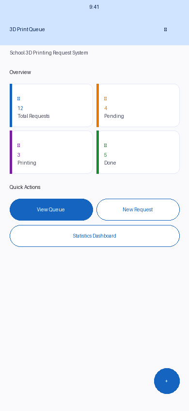
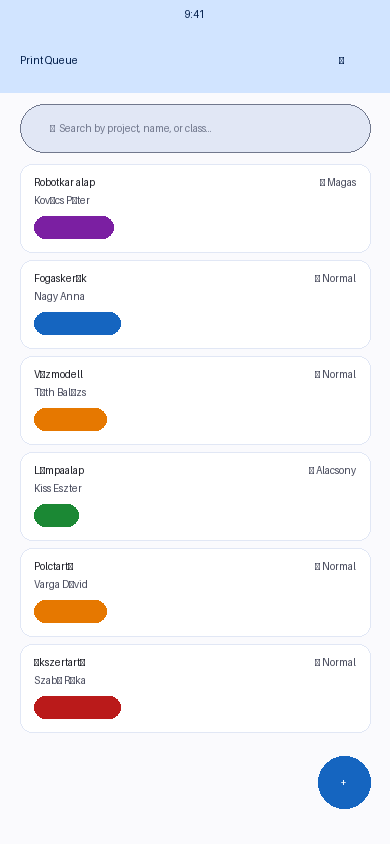
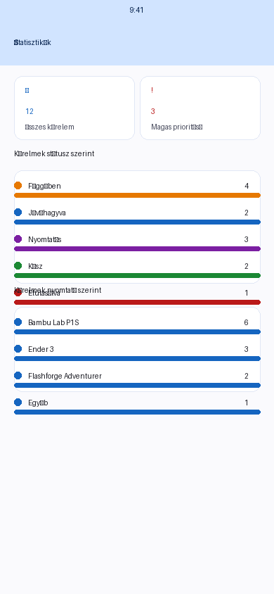
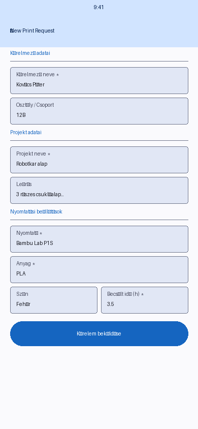
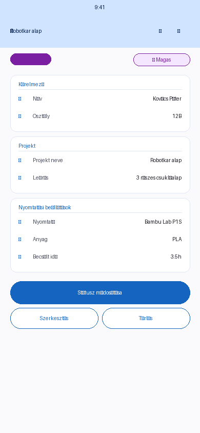

# 🖨️ 3D Print Queue – Iskolai 3D Nyomtatási Kérelem Rendszer

<p align="center">
  
  &nbsp;&nbsp;
  
  &nbsp;&nbsp;
  
</p>

## Mi ez a projekt?

A **3D Print Queue** egy Flutter-alapú mobilalkalmazás, amelyet iskolai 3D nyomtatási igények kezelésére terveztek. Lehetővé teszi a diákok számára, hogy 3D nyomtatási kérelmeket nyújtsanak be, a tanárok és üzemeltetők pedig nyomon követhessék és kezelhessék ezeket – egy helyen, papírmentes formában.

Az alkalmazás teljesen **offline** működik: minden adat az eszközön tárolódik a [Hive](https://pub.dev/packages/hive) nevű könnyűsúlyú adatbázis segítségével, nincs szükség szerverre vagy internet-kapcsolatra.

---

## ✨ Főbb funkciók

| Funkció | Leírás |
|---|---|
| 📋 **Kérelmek beküldése** | Részletes nyomtatási kérelem kitöltése (kérelmező neve, osztály, projekt, nyomtató, anyag, szín, becsült idő, prioritás) |
| 📂 **Kérelem-lista (Print Queue)** | Összes kérelem megtekintése, keresés projekt/név/osztály szerint, szűrés státusz és nyomtató szerint |
| 🔍 **Részletes nézet** | Egy-egy kérelem összes adatának megtekintése, státusz módosítása, szerkesztés, törlés |
| 📊 **Statisztika dashboard** | Összesített kimutatás státusz és nyomtató szerint, haladásjelző sávokkal |
| 🏠 **Főképernyő** | Gyors áttekintő kártyák (összes / függőben / nyomtatás / kész), gyorsgombok |
| 💾 **Offline tárolás** | Minden adat helyi Hive adatbázisban tárolódik – nincs szükség internetre |

---

## 📱 Képernyőképek

### Főképernyő
Az alkalmazás indulásakor látható összesítő nézet: statisztikai kártyák és gyorsindító gombok.

<p align="center">
  
</p>

### Kérelmek listája (Print Queue)
Az összes kérelem listája keresési és szűrési lehetőséggel.

<p align="center">
  
</p>

### Új kérelem beküldése
Részletes űrlap a nyomtatási igény beküldéséhez.

<p align="center">
  
</p>

### Kérelem részletei
Egy kérelem összes adatának megtekintése, státusz módosítással.

<p align="center">
  
</p>

### Statisztika dashboard
Összesített kimutatás státusz és nyomtató szerint.

<p align="center">
  
</p>

---

## 🗂️ Státuszok és prioritások

### Kérelem státuszok

| Státusz | Leírás |
|---|---|
| ⏳ **Függőben** (Pending) | Frissen beküldött, még el nem bírált kérelem |
| ✅ **Jóváhagyva** (Approved) | Elfogadott, nyomtatásra váró kérelem |
| 🖨️ **Nyomtatás** (Printing) | Jelenleg nyomtatás alatt lévő munka |
| ✔️ **Kész** (Done) | Sikeresen befejezett nyomtatás |
| ❌ **Elutasítva** (Rejected) | Elutasított kérelem |

### Prioritási szintek

| Prioritás | Leírás |
|---|---|
| 🔴 **Magas** | Sürgős, soron kívüli nyomtatás |
| 🟡 **Normal** | Normál sorrend |
| 🔵 **Alacsony** | Ráér, alacsony sürgősség |

---

## 🛠️ Technológiai stack

| Réteg | Technológia |
|---|---|
| **UI keretrendszer** | [Flutter](https://flutter.dev) (Material 3) |
| **Állapotkezelés** | [Provider](https://pub.dev/packages/provider) |
| **Helyi adatbázis** | [Hive](https://pub.dev/packages/hive) + [hive_flutter](https://pub.dev/packages/hive_flutter) |
| **Egyedi azonosítók** | [uuid](https://pub.dev/packages/uuid) |
| **Dátumformázás** | [intl](https://pub.dev/packages/intl) |
| **Platform** | Android, iOS |

---

## 🚀 Telepítés és futtatás

### Előfeltételek

- [Flutter SDK](https://docs.flutter.dev/get-started/install) (≥ 3.0.0)
- Android Studio / Xcode (emulátor vagy fizikai eszköz)

### Lépések

```bash
# 1. Klónozd a repót
git clone https://github.com/merenyimiklos/3dprintrequestsystem.git
cd 3dprintrequestsystem

# 2. Telepítsd a függőségeket
flutter pub get

# 3. Indítsd el az alkalmazást
flutter run
```

> **Megjegyzés:** Az alkalmazás nem igényel semmilyen backend konfigurációt – az összes adat helyileg tárolódik az eszközön.

### Tesztek futtatása

```bash
flutter test
```

---

## 📁 Projektstruktúra

```
lib/
├── main.dart                    # Belépési pont, app inicializálás
├── models/
│   ├── print_request.dart       # Adatmodell + Hive adapter
│   └── enums.dart               # Státusz, prioritás, nyomtató, anyag enum-ok
├── providers/
│   └── request_provider.dart    # Állapotkezelés (Provider)
├── screens/
│   ├── home_screen.dart         # Főképernyő
│   ├── request_list_screen.dart # Kérelem-lista (keresés, szűrés)
│   ├── add_request_screen.dart  # Új kérelem űrlap
│   ├── request_detail_screen.dart # Kérelem részletei
│   ├── edit_request_screen.dart # Kérelem szerkesztése
│   └── dashboard_screen.dart    # Statisztika dashboard
├── services/
│   └── hive_service.dart        # Hive inicializálás és adathozzáférés
├── widgets/
│   ├── request_card.dart        # Kérelem-kártya widget
│   ├── stats_card.dart          # Statisztika kártya widget
│   ├── status_badge.dart        # Státusz badge
│   ├── filter_bar_widget.dart   # Szűrő sáv
│   └── empty_state_widget.dart  # Üres állapot widget
└── utils/
    ├── app_constants.dart       # Konstansok (színek, padding, szövegek)
    ├── enum_helpers.dart        # Enum → szöveg/szín segédfüggvények
    └── date_formatter.dart      # Dátumformázó
```

---

## 🖨️ Támogatott nyomtatók

Az alkalmazás az alábbi nyomtatómodelleket kezeli alapértelmezetten:

- **Bambu Lab P1S**
- **Ender 3**
- **Flashforge Adventurer**
- **Egyéb** (Other)

---

## 📝 Hogyan működik?

1. **Diák kérést küld be** → megnyitja az „Új kérelem" űrlapot, kitölti az adatokat (neve, osztálya, projekt neve, nyomtató, anyag, becsült nyomtatási idő), majd elküldi.
2. **Tanár / üzemeltető áttekinti** → a Print Queue-ban látja az összes beérkező kérelmet. Szűrhet státusz vagy nyomtató szerint.
3. **Státusz frissítése** → a kérelem részletei oldalon a „Státusz módosítása" gombbal léptethetők előre a kérelmek (Függőben → Jóváhagyva → Nyomtatás → Kész).
4. **Statisztikák megtekintése** → a Dashboard megmutatja, hány kérelem van az egyes státuszokban, és melyik nyomtatót veszik legjobban igénybe.

---

## 📄 Licenc

Ez a projekt oktatási célokra készült.
